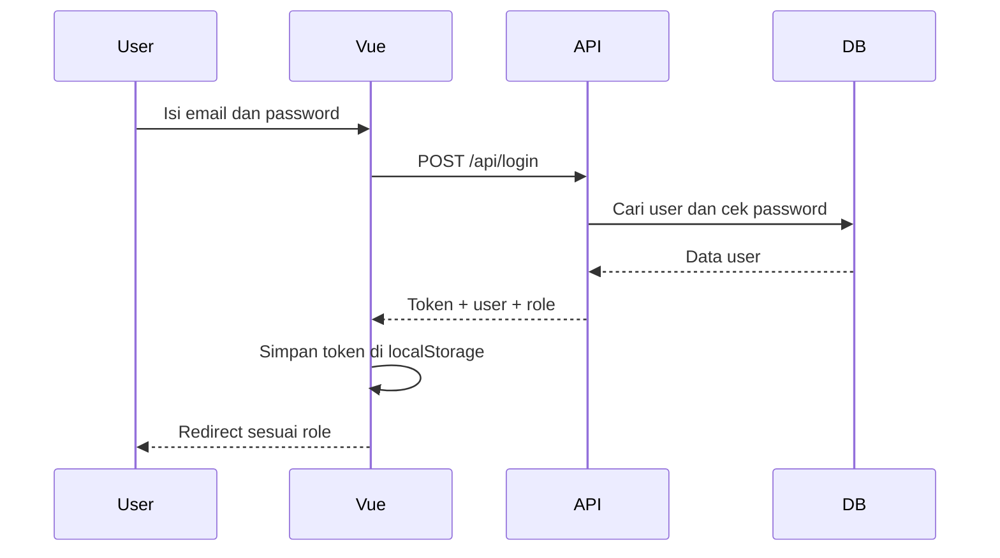
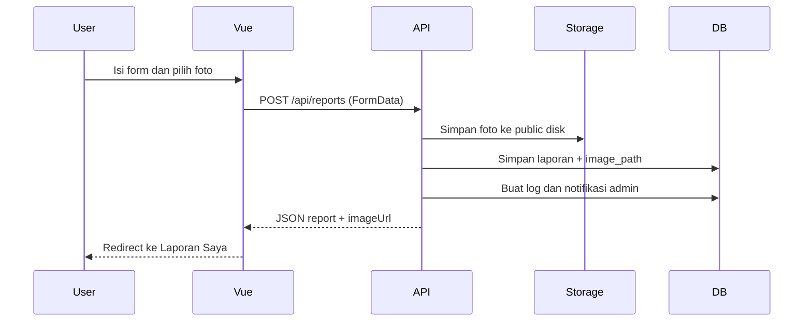
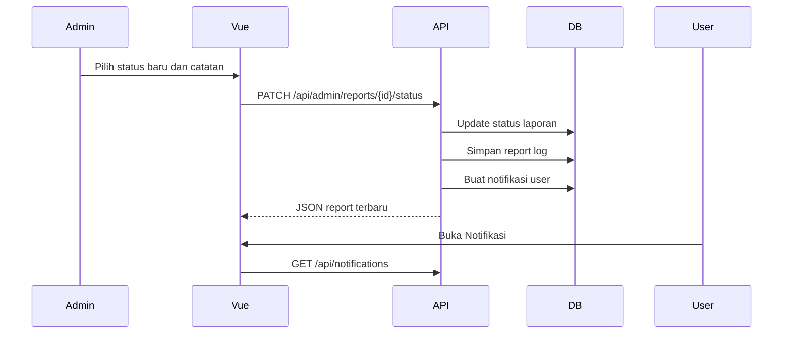
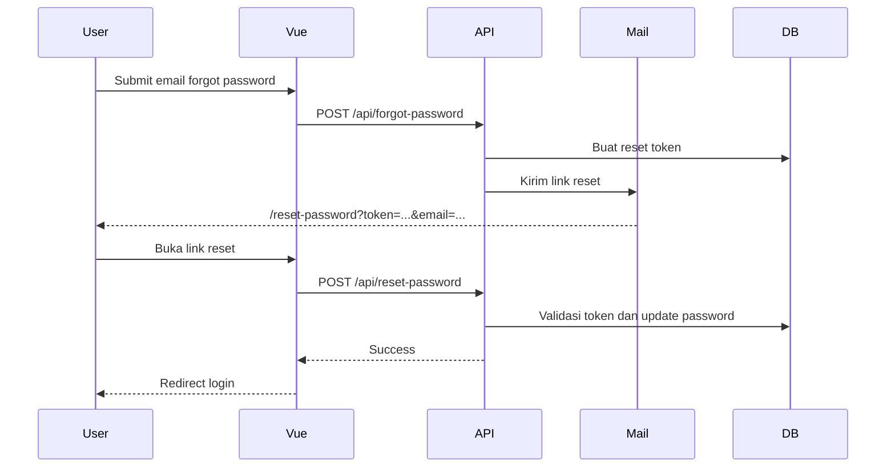

# FilkomCare

## 1. Deskripsi Project

FilkomCare adalah aplikasi pelaporan fasilitas untuk lingkungan Fakultas Ilmu Komputer. Aplikasi ini membantu mahasiswa atau user melaporkan kerusakan fasilitas, melampirkan foto bukti, memantau status laporan, dan menerima notifikasi ketika laporan diproses oleh admin.

Project ini memakai arsitektur frontend dan backend terpisah:

- Frontend Vue 3 bertugas menampilkan halaman, form, tabel, modal, navigasi, i18n, dan interaksi user.
- Backend Laravel API bertugas menangani autentikasi, role, validasi request, database, file upload, notifikasi, export, dan response JSON.
- API menjadi jembatan komunikasi antara frontend dan backend.

## 2. Teknologi yang Digunakan

| Bagian | Teknologi | Fungsi |
| --- | --- | --- |
| Backend | Laravel API | Server, controller, route API, validasi, database |
| Auth | Laravel Sanctum | Token API untuk login user/admin |
| Database | MySQL/MariaDB | Menyimpan user, laporan, kategori, status, notifikasi |
| Storage | Laravel public disk | Menyimpan foto laporan di `storage/app/public` |
| Frontend | Vue 3 | UI, halaman, reactive state |
| State | Pinia | Menyimpan auth user, token, role, session |
| Routing | Vue Router | Navigasi halaman dan route guard |
| HTTP | Axios | Request frontend ke backend API |
| Styling | Tailwind CSS | Layout, warna, spacing, responsive UI |
| Bahasa | vue-i18n | Bahasa Indonesia dan English |

## 3. Struktur Folder

```text
PROJEKPAWLAN/
|-- backend/
|   |-- app/Http/Controllers/Api/
|   |   |-- AuthController.php
|   |   |-- DashboardController.php
|   |   |-- NotificationController.php
|   |   |-- ProfileController.php
|   |   `-- ReportController.php
|   |-- app/Models/
|   |   |-- User.php
|   |   |-- Report.php
|   |   |-- Category.php
|   |   |-- Status.php
|   |   `-- Notification.php
|   |-- app/Support/ApiFormatter.php
|   |-- database/migrations/
|   |-- database/seeders/
|   |-- routes/api.php
|   `-- storage/app/public/
|-- frontend/
|   |-- src/views/
|   |-- src/components/
|   |-- src/router/
|   |-- src/stores/
|   |-- src/services/
|   |-- src/i18n/
|   `-- src/composables/
`-- README.md
```

Penjelasan folder penting:

- `backend/routes/api.php`: daftar endpoint API.
- `backend/app/Http/Controllers/Api`: logic utama backend.
- `backend/app/Models`: representasi tabel database dan relasi Eloquent.
- `backend/database/migrations`: struktur tabel database.
- `backend/app/Support/ApiFormatter.php`: formatter response JSON agar siap dipakai frontend.
- `frontend/src/views`: halaman utama seperti Dashboard, CreateReport, Notifications.
- `frontend/src/components`: komponen layout seperti sidebar, topbar, recent reports.
- `frontend/src/router/index.js`: daftar route frontend dan guard role.
- `frontend/src/stores/auth.js`: state login, token, user, role.
- `frontend/src/services/api.js`: konfigurasi Axios.
- `frontend/src/i18n/messages.js`: daftar teks bahasa Indonesia dan English.

## 4. Arsitektur Aplikasi

FilkomCare memakai pola client-server.

```text
User/Admin
   ↓
Vue 3 Frontend
   ↓ Axios + Bearer Token
Laravel API
   ↓ Eloquent ORM
Database + Storage
```

Frontend tidak menyimpan data utama secara dummy. Data laporan, dashboard, notifikasi, status, kategori, profile, dan auth berasal dari backend API. Frontend hanya menyimpan state sementara untuk UI dan token login.

## 5. Alur Backend

1. Request masuk ke `routes/api.php`.
2. Route mengarahkan request ke controller yang sesuai.
3. Controller melakukan validasi request.
4. Controller membaca atau menulis data lewat Model Eloquent.
5. Jika perlu, backend menyimpan file ke storage Laravel.
6. Response diformat menjadi JSON, banyak data laporan dan notifikasi memakai `ApiFormatter`.
7. Untuk endpoint protected, middleware `auth:sanctum` mengecek token.
8. Untuk endpoint admin, middleware `admin` mengecek role user.

Bagian penting backend:

- `AuthController`: login, register, logout, forgot password, reset password.
- `ReportController`: daftar laporan, laporan saya, create report, cancel report, admin update status, similar reports.
- `DashboardController`: statistik dashboard user/admin, export CSV, generate report.
- `NotificationController`: list notifikasi, detail, mark read, read all.
- `ProfileController`: profile user, update profile, change password.
- `ApiFormatter`: menyamakan format response supaya frontend tidak perlu mapping rumit.

## 6. Alur Frontend

1. `main.js` membuat app Vue, memasang Pinia, router, dan i18n.
2. `router/index.js` menentukan route dan guard.
3. `auth.js` memulihkan session dari `localStorage`.
4. View memanggil API lewat `services/api.js`.
5. Axios otomatis menambahkan token ke header `Authorization`.
6. View menormalisasi response backend ke bentuk yang mudah ditampilkan.
7. Komponen seperti sidebar/topbar/card/modal menampilkan data ke user.

Bagian penting frontend:

- `Dashboard.vue`: dashboard mahasiswa.
- `AdminDashboard.vue`: dashboard admin.
- `CreateReport.vue`: form laporan dan upload foto.
- `AllReports.vue`: semua laporan.
- `MyReports.vue`: laporan milik user login.
- `AdminReportManagement.vue`: tabel admin dan update status.
- `Notifications.vue`: notifikasi user.
- `AdminNotifications.vue`: notifikasi admin.
- `Profile.vue`: update profile.
- `Settings.vue`: bahasa dan ganti password.
- `ResetPassword.vue`: reset password dari link email.

## 7. Alur Komunikasi Frontend dan Backend

Contoh umum:

1. User membuka halaman Vue.
2. View memanggil endpoint API dengan Axios.
3. Axios mengambil token dari `localStorage.auth_token`.
4. Token dikirim sebagai `Authorization: Bearer TOKEN`.
5. Backend memvalidasi token menggunakan Sanctum.
6. Controller memproses request dan database.
7. Backend mengembalikan JSON.
8. Frontend menormalisasi data.
9. UI menampilkan card, tabel, badge, modal, atau notifikasi.

## 8. Role dan Hak Akses

| Role | Hak akses |
| --- | --- |
| User/Mahasiswa | Dashboard user, semua laporan, laporan saya, buat laporan, cancel laporan milik sendiri, notifikasi, profile, settings |
| Admin | Dashboard admin, management laporan, update status laporan, notifikasi admin, export data, generate report, profile, settings |

Role ditentukan oleh backend dari database. Register frontend selalu membuat user biasa, bukan admin. Admin dibuat lewat seeder/database.

Frontend route guard:

- `requiresAuth`: hanya bisa dibuka jika login.
- `guestOnly`: hanya untuk user belum login, seperti login/register/forgot-password/reset-password.
- `role`: membatasi halaman khusus admin atau user.

## 9. Fitur Utama

- Login dan register.
- Forgot password dan reset password via email.
- Dashboard user dan dashboard admin.
- Membuat laporan fasilitas.
- Upload foto laporan.
- Laporan mirip terdekat.
- Semua laporan dan laporan saya.
- Admin management laporan.
- Update status laporan oleh admin.
- Notifikasi user dan admin.
- Profile dan settings.
- Ganti password.
- Ganti bahasa Indonesia/English.
- Export data laporan CSV.
- Generate report.

## 10. Dokumentasi API Endpoint

| Method | Endpoint | Controller | Fungsi | Role |
| --- | --- | --- | --- | --- |
| POST | `/api/register` | AuthController@register | Daftar user baru | Guest |
| POST | `/api/login` | AuthController@login | Login user/admin | Guest |
| POST | `/api/forgot-password` | AuthController@forgotPassword | Kirim link reset password | Guest |
| POST | `/api/reset-password` | AuthController@resetPassword | Reset password dengan token | Guest |
| POST | `/api/logout` | AuthController@logout | Logout dan hapus token aktif | Auth |
| GET | `/api/me` | AuthController@me | Ambil user aktif | Auth |
| GET | `/api/categories` | CategoryController@index | Ambil kategori laporan | Auth |
| GET | `/api/statuses` | StatusController@index | Ambil status laporan | Auth |
| GET | `/api/user/dashboard` | DashboardController@userDashboard | Statistik dashboard user | User |
| GET | `/api/reports` | ReportController@index | Semua laporan | Auth |
| GET | `/api/reports/my` | ReportController@myReports | Laporan milik user login | User |
| GET | `/api/my-reports` | ReportController@myReports | Alias laporan saya | User |
| GET | `/api/reports/options` | ReportController@options | Data pendukung CreateReport | User |
| GET | `/api/reports/similar` | ReportController@similar | Maksimal 5 laporan terbaru/mirip | User |
| POST | `/api/reports` | ReportController@store | Buat laporan baru | User |
| GET | `/api/reports/{report}` | ReportController@show | Detail laporan | Auth |
| PATCH | `/api/reports/{report}/cancel` | ReportController@cancel | Batalkan laporan sendiri | User |
| GET | `/api/notifications` | NotificationController@index | Notifikasi user | User |
| GET | `/api/notifications/{notification}` | NotificationController@show | Detail notifikasi user | User |
| PATCH | `/api/notifications/{notification}/read` | NotificationController@read | Tandai satu notifikasi dibaca | User |
| PATCH | `/api/notifications/read-all` | NotificationController@readAll | Tandai semua notifikasi user | User |
| GET | `/api/profile` | ProfileController@show | Ambil profile | Auth |
| PUT | `/api/profile` | ProfileController@update | Update profile | Auth |
| POST | `/api/change-password` | ProfileController@changePassword | Ganti password login | Auth |
| GET | `/api/admin/dashboard` | DashboardController@adminDashboard | Statistik dashboard admin | Admin |
| GET | `/api/admin/reports/stats` | DashboardController@adminReportStats | Statistik laporan admin | Admin |
| GET | `/api/admin/reports/export` | DashboardController@exportReports | Export laporan CSV | Admin |
| POST | `/api/admin/reports/generate` | DashboardController@generateReport | Generate report dashboard | Admin |
| GET | `/api/admin/reports` | ReportController@adminIndex | Semua laporan untuk admin | Admin |
| GET | `/api/admin/reports/{report}` | ReportController@adminShow | Detail laporan admin | Admin |
| PATCH | `/api/admin/reports/{report}/status` | ReportController@updateStatus | Update status laporan | Admin |
| GET | `/api/admin/notifications` | NotificationController@adminIndex | Notifikasi admin | Admin |
| PATCH | `/api/admin/notifications/read-all` | NotificationController@adminReadAll | Tandai semua notifikasi admin | Admin |

## 11. Penjelasan Controller Backend

### AuthController

- `register()`: validasi data register, membuat user role `user`, hash password, return token dan user.
- `login()`: cek email dan password, membuat token Sanctum, return role untuk redirect frontend.
- `logout()`: menghapus token aktif.
- `me()`: mengembalikan data user login.
- `forgotPassword()`: menerima email dan meminta Laravel membuat reset token serta mengirim email.
- `resetPassword()`: validasi token, email, password baru, lalu update password user.

### ProfileController

- `show()`: mengembalikan data profile user aktif.
- `update()`: update nama, NIM, dan nomor telepon. Email tidak diubah dari profile.
- `changePassword()`: validasi password lama, lalu simpan password baru.

### ReportController

- `index()`: menampilkan semua laporan dengan filter search/status/category/sort/limit.
- `myReports()`: menampilkan laporan milik user login.
- `options()`: mengambil kategori, laporan mirip, dan summary untuk halaman create report.
- `similar()`: mengambil maksimal 5 laporan terbaru untuk bagian Laporan Mirip Terdekat.
- `store()`: membuat laporan baru, menyimpan foto, status awal `Dikirim`, log, dan notifikasi admin.
- `show()`: detail laporan.
- `cancel()`: user membatalkan laporan sendiri jika status masih `Dikirim`.
- `adminIndex()`: daftar laporan untuk admin.
- `adminShow()`: detail laporan untuk admin.
- `updateStatus()`: admin mengubah status laporan, menyimpan catatan admin, membuat log, dan notifikasi user.

### DashboardController

- `userDashboard()`: menghitung statistik laporan milik user.
- `adminDashboard()`: menghitung statistik semua laporan.
- `adminReportStats()`: statistik untuk halaman management admin.
- `exportReports()`: export laporan CSV, termasuk link foto.
- `generateReport()`: trigger generate report dan mengembalikan payload dashboard.

### NotificationController

- `index()`: daftar notifikasi user.
- `show()`: detail notifikasi user.
- `read()`: tandai satu notifikasi user dibaca.
- `readAll()`: tandai semua notifikasi user dibaca.
- `adminIndex()`: daftar notifikasi admin.
- `adminRead()`: tandai satu notifikasi admin dibaca.
- `adminReadAll()`: tandai semua notifikasi admin dibaca.

## 12. Penjelasan Model dan Database

### User

Menyimpan akun admin/user. Relasi:

- `role()`: user punya role.
- `reports()`: user bisa punya banyak laporan.
- `notifications()`: user bisa punya banyak notifikasi.
- `reportLogs()`: user bisa punya banyak log aktivitas laporan.

### Report

Menyimpan laporan fasilitas. Field penting:

- `report_code`: kode seperti `#REP-2026-002`.
- `user_id`: pelapor.
- `category_id`: kategori.
- `status_id`: status laporan.
- `title`, `description`, `location`.
- `image_path`: path foto di storage.
- `admin_response`: catatan admin.
- `cancelled_at`, `processed_at`, `completed_at`.

Relasi:

- `user()`
- `category()`
- `status()`
- `logs()`

### Category

Master data kategori laporan, misalnya sarana belajar atau fasilitas umum.

### Status

Master data status laporan:

- `Dikirim`
- `Diproses`
- `Selesai`
- `Dibatalkan`

### Notification

Menyimpan notifikasi user/admin. Field `data` berupa JSON berisi konteks laporan seperti report id, kode laporan, status lama, status baru, lokasi, kategori, dan catatan admin.

## 13. Penjelasan Halaman Frontend

### Dashboard.vue

Dashboard user. Mengambil `/api/user/dashboard`, menampilkan statistik laporan user dan laporan terbaru maksimal 5 item.

### AdminDashboard.vue

Dashboard admin. Mengambil `/api/admin/dashboard`, menampilkan statistik semua laporan, laporan baru masuk, laporan terbaru, tombol export, dan tombol generate report.

### CreateReport.vue

Form laporan fasilitas. Mengambil kategori dan laporan mirip. Saat submit memakai `FormData` agar foto bisa dikirim sebagai file.

### AllReports.vue

Menampilkan semua laporan dengan filter search, status, kategori, pagination, card laporan, dan modal detail.

### MyReports.vue

Menampilkan laporan milik user login. User bisa melihat detail dan membatalkan laporan jika status masih `Dikirim`.

### Notifications.vue

Menampilkan notifikasi user. Notifikasi bisa diklik, ditandai read, dan menampilkan modal detail laporan/status.

### AdminReportManagement.vue

Halaman admin untuk melihat semua laporan, preview foto, update status laporan, pagination, export, dan modal update.

### AdminNotifications.vue

Notifikasi untuk admin, terutama laporan baru atau laporan yang dibatalkan.

### Profile.vue

Menampilkan dan mengubah profile user/admin. Sidebar dinamis sesuai role.

### Settings.vue

Mengatur bahasa dan ganti password. Locale disimpan per user.

### ResetPassword.vue

Halaman reset password dari email. Membaca `token` dan `email` dari query URL lalu mengirim password baru ke `/api/reset-password`.

## 14. Penjelasan Komponen Frontend

### DashboardSidebar.vue

Sidebar untuk user/mahasiswa. Berisi menu dashboard, semua laporan, laporan saya, buat laporan, notifikasi, dan logout.

### AdminSidebar.vue

Sidebar untuk admin. Berisi dashboard admin, management laporan, notifikasi admin, dan logout.

### DashboardTopbar.vue

Topbar umum untuk halaman user/admin. Menampilkan navigasi profile dan settings.

### DashboardRecentReports.vue

Komponen list laporan terbaru di dashboard user. Menampilkan maksimal 5 laporan dan fallback empty/loading state.

## 15. Upload Gambar Laporan

Alur upload foto:

1. User memilih gambar di `CreateReport.vue`.
2. Frontend menyimpan `File` object.
3. Saat submit, frontend membuat `FormData`.
4. Field `image` dikirim ke backend.
5. Backend memvalidasi file:
   - image
   - jpg/jpeg/png/webp
   - maksimal 5MB
6. Backend menyimpan file ke `storage/app/public/reports`.
7. Database hanya menyimpan path, misalnya `reports/file.jpg`.
8. Response backend mengirim `imageUrl`.
9. Frontend menampilkan gambar dengan ``.

Command penting:

```bash
php artisan storage:link
```

Tanpa `storage:link`, file di `storage/app/public` tidak bisa diakses browser lewat `/storage/...`.

## 16. Forgot Password dan Reset Password

Alur:

1. User membuka `/forgot-password`.
2. User mengisi email.
3. Frontend POST ke `/api/forgot-password`.
4. Laravel membuat reset token.
5. Laravel mengirim email reset password.
6. Link email diarahkan ke frontend:

```text
http://localhost:5173/reset-password?token=TOKEN&email=EMAIL
```

7. `ResetPassword.vue` membaca token dan email dari query.
8. User mengisi password baru dan konfirmasi.
9. Frontend POST ke `/api/reset-password`.
10. Backend validasi token dan update password.
11. User diarahkan ke `/login`.

Konfigurasi penting:

- `.env`: `FRONTEND_URL=http://localhost:5173`
- `config/app.php`: `frontend_url`
- `AppServiceProvider.php`: `ResetPassword::createUrlUsing(...)`

## 17. Notifikasi

Notifikasi dibuat pada beberapa kejadian:

- User membuat laporan, admin mendapat notifikasi.
- User membatalkan laporan, admin mendapat notifikasi.
- Admin update status laporan, user mendapat notifikasi.

Data notifikasi memuat:

- kode laporan
- judul laporan
- lokasi
- kategori
- status lama
- status baru
- catatan admin
- waktu update

Frontend menampilkan:

- daftar notifikasi
- badge unread
- tombol mark all read
- modal detail notifikasi

## 18. Pengaturan Bahasa/i18n

Frontend memakai `vue-i18n`.

File penting:

- `frontend/src/i18n/index.js`
- `frontend/src/i18n/messages.js`
- `frontend/src/composables/useLocale.js`
- `frontend/src/views/Settings.vue`

Locale disimpan per akun:

```text
locale_user_1
locale_user_2
locale_guest
```

Dengan cara ini, jika admin memilih English, user biasa di browser yang sama tidak ikut berubah.

## 19. Cara Menjalankan Project

### Backend

```bash
cd backend
composer install
cp .env.example .env
php artisan key:generate
php artisan migrate --seed
php artisan storage:link
php artisan serve
```

Jika config berubah:

```bash
php artisan optimize:clear
php artisan config:clear
php artisan cache:clear
```

### Frontend

```bash
cd frontend
npm install
npm run dev
```

Default URL:

- Backend: `http://localhost:8000`
- API: `http://localhost:8000/api`
- Frontend: `http://localhost:5173`

## 20. Environment Variable

Environment backend penting:

```env
APP_URL=http://localhost:8000
FRONTEND_URL=http://localhost:5173

DB_CONNECTION=mysql
DB_HOST=127.0.0.1
DB_PORT=3306
DB_DATABASE=filkomcare
DB_USERNAME=root
DB_PASSWORD=

MAIL_MAILER=log
MAIL_HOST=127.0.0.1
MAIL_PORT=2525
MAIL_USERNAME=null
MAIL_PASSWORD=null
MAIL_FROM_ADDRESS="noreply@filkomcare.test"
MAIL_FROM_NAME="FilkomCare"
```

Environment frontend opsional:

```env
VITE_API_URL=http://localhost:8000/api
```

## 21. Flow Diagram

### Login Flow



### Create Report Flow



### Admin Update Status Flow



### Forgot/Reset Password Flow



## 22. Catatan untuk Presentasi

Penjelasan sederhana:

- Frontend adalah tampilan dan tempat user berinteraksi.
- Backend adalah pusat data dan proses bisnis.
- API adalah jembatan komunikasi antara frontend dan backend.
- Database menyimpan user, laporan, status, kategori, notifikasi, dan log.
- Storage menyimpan file gambar asli.
- Database tidak menyimpan file gambar sebagai BLOB, hanya path file.
- Token Sanctum dipakai agar backend tahu siapa user yang sedang request.
- Role admin/user membatasi halaman dan endpoint yang boleh diakses.
- `ApiFormatter` membantu response backend konsisten untuk frontend.
- `router/index.js` menjaga user tidak masuk halaman role yang salah.
- `auth.js` menyimpan token, user, role, dan session login.

Kalimat presentasi singkat:

> FilkomCare memakai Vue sebagai antarmuka, Laravel sebagai API, dan database sebagai sumber data utama. Frontend memanggil backend melalui Axios, token dikirim dengan Bearer token, backend memvalidasi request dan role, lalu mengembalikan JSON yang ditampilkan ke UI.

## 23. Troubleshooting

### Reset link mengarah ke port yang salah

Pastikan:

```env
FRONTEND_URL=http://localhost:5173
```

Lalu jalankan:

```bash
php artisan optimize:clear
php artisan config:clear
php artisan cache:clear
```

### Foto laporan tidak muncul

Pastikan:

```bash
php artisan storage:link
```

Cek juga response API punya `imageUrl`.

### API 401 Unauthorized

Kemungkinan token hilang atau expired. Logout lalu login kembali. Pastikan request frontend membawa header:

```text
Authorization: Bearer TOKEN
```

### Admin tidak bisa akses halaman admin

Pastikan role user di database adalah admin atau relasi role mengarah ke role `admin`.

### Database kosong

Jalankan:

```bash
php artisan migrate --seed
```

Seeder minimal perlu membuat admin, kategori, dan status.
